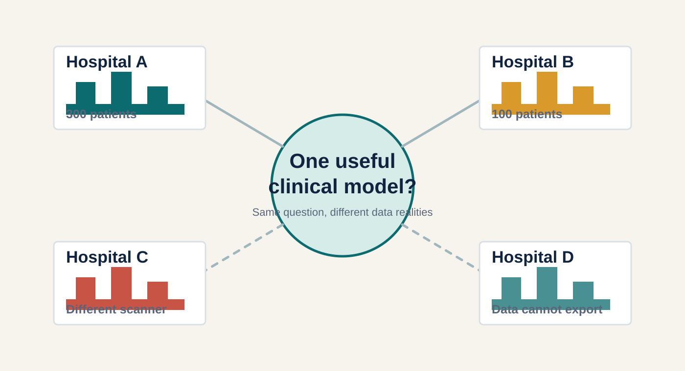
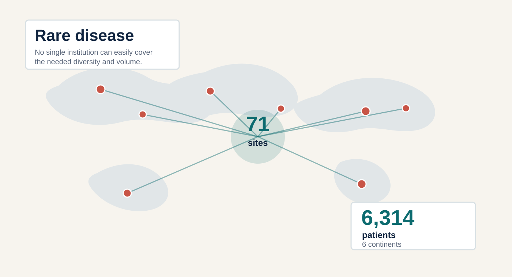
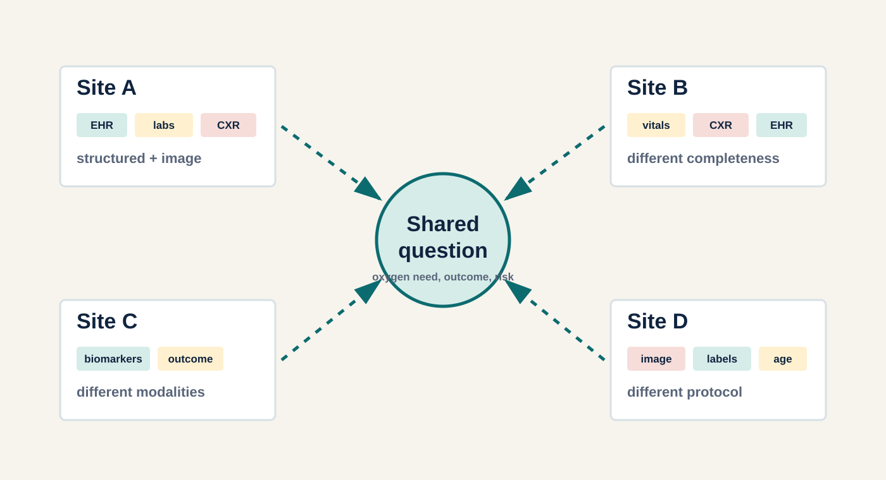
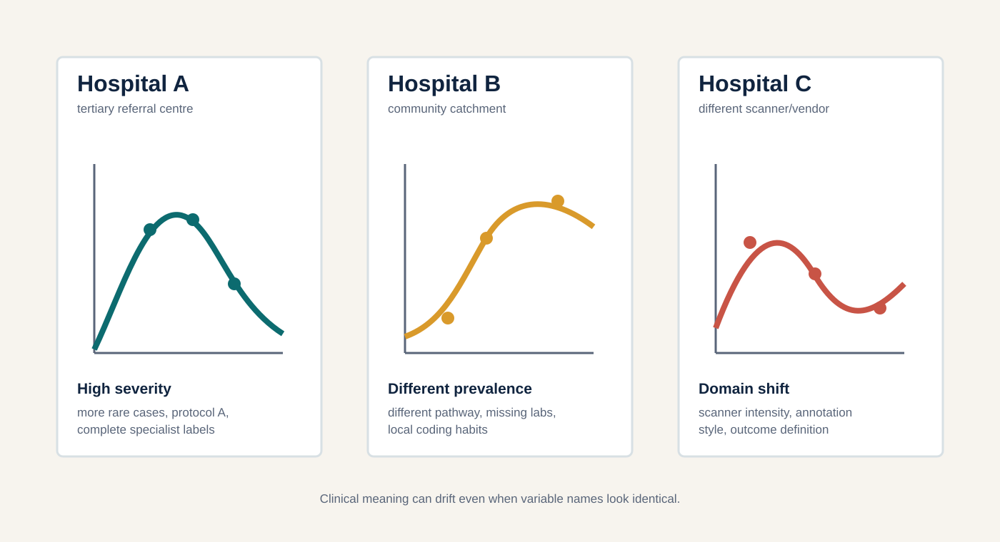
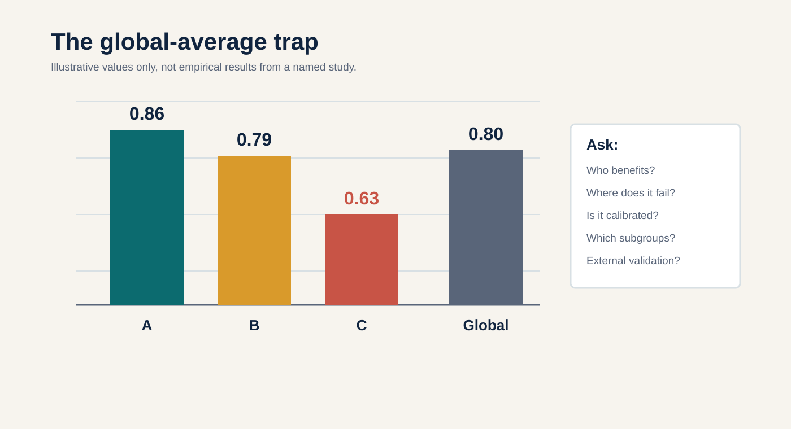
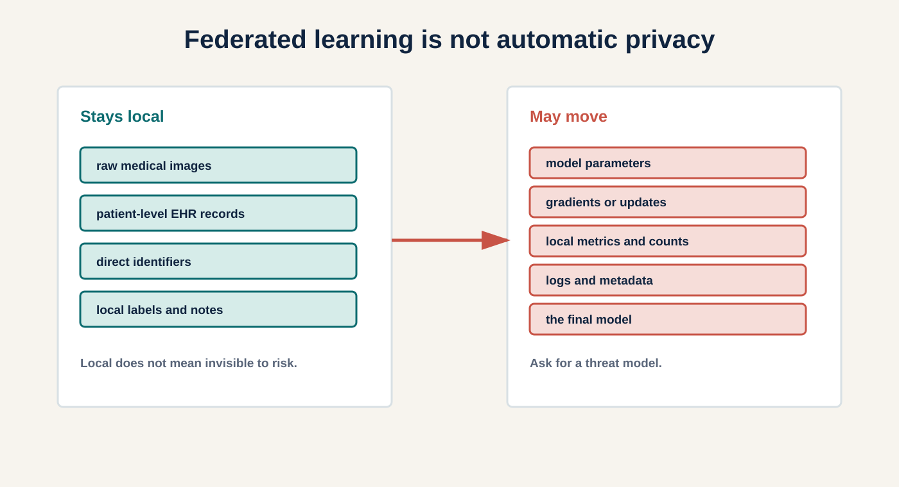
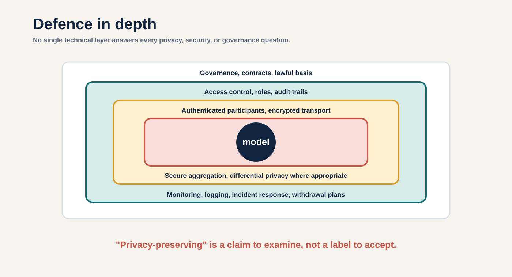
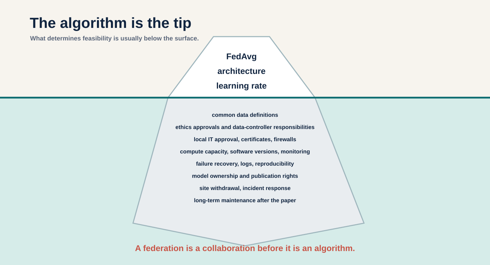
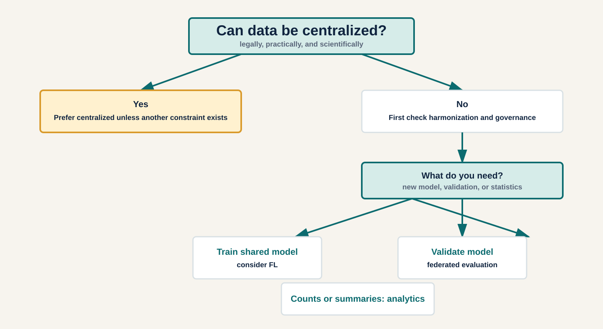
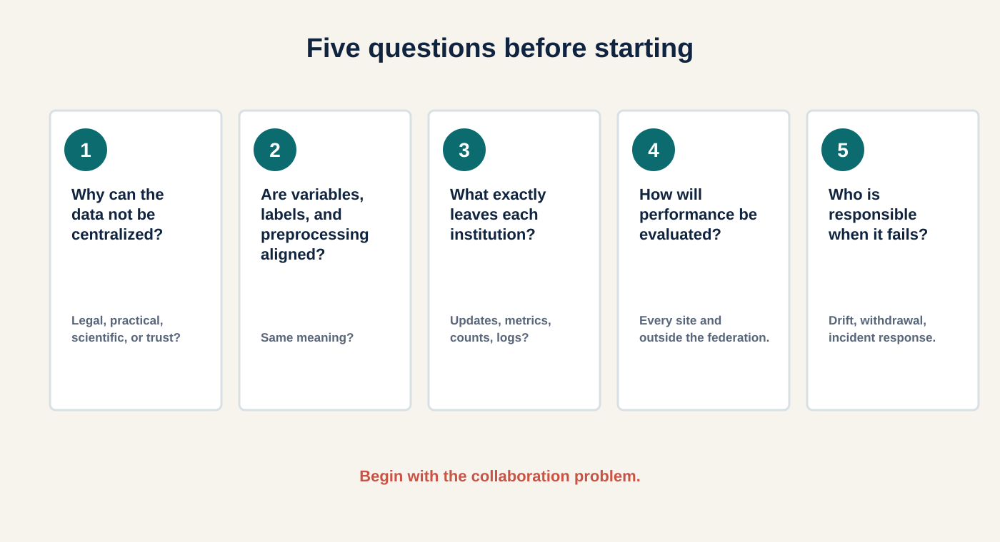

# Federated Learning in Medical AI {.title-slide}

::: {.title-grid}
::: {}

18 August 2026

When Data Cannot Move

The promise, the pitfalls, and a practical decision guide

**Geng Sun**  
Industrial PhD  
Cercare Medical / Aarhus University

Clinical AI often fails at the border between institutions: law, trust, infrastructure, and meaning.

:::

::: {}
{.visual fig-alt="Four hospitals with different constraints around a shared clinical modelling question."}
:::
:::

::: {.notes}
Timing: 1.5 minutes.

Main point: Frame the lecture as a clinical collaboration problem, not as an algorithm lecture. Suggested wording: "Federated learning is interesting because many medical questions are multicentre by nature, but the data are not always allowed or able to become multicentre in the usual way."

Transition: Introduce the fictional hospitals and ask the audience what they would do first.

If running late: keep only the central question and the three constraints: sensitive data, heterogeneous sites, shared clinical question.
:::

# Opening Dilemma

::: {.two-col}
::: {}
{.visual fig-alt="Four fictional hospitals around one shared modelling question."}
:::

::: {}

Audience choice

We want **one useful model**. What are our options?

::: {.incremental}
1. Move all data into one central environment.
2. Train one independent model at each hospital.
3. Move the model rather than the raw data.
4. Abandon the multicentre project.
:::

Opening scenario is fictional.

:::
:::

::: {.notes}
Timing: 2 minutes.

Main point: Let the room recognize that "federated" is one option among several, not the default answer. Ask for a quick show of hands or a few comments.

Suggested wording: "Each option solves one problem and creates another. Centralization is often simpler. Local-only is often realistic. Federation is attractive when the collaboration is real but data movement is blocked."

Transition: Move from the dilemma to five named research designs.

If running late: do a rhetorical rather than participatory poll.
:::

# Five Possible Research Designs

{.visual tall fig-alt="Five visual workflows comparing centralized, local-only, federated learning, federated evaluation, and federated analytics."}

Original diagram; concepts informed by <a href="https://doi.org/10.1038/s41746-020-00323-1">Rieke et al., 2020</a>, <a href="https://doi.org/10.1038/s42256-023-00652-2">Karargyris et al., 2023</a>, and Google Research federated analytics.

::: {.notes}
Timing: 2.5 minutes.

Main point: "Federated" is a family of research designs. The practical question is whether we need shared training, distributed evaluation, or only aggregate statistics.

Suggested wording: "If your scientific question is a prevalence estimate, federated training may be a very expensive answer to a simpler analytics question."

Transition: Zoom into the federated learning branch and explain one round.

If running late: emphasize centralized, FL, federated evaluation, and federated analytics; leave local-only as the default baseline.
:::

## Backup: Terms Without Jargon

::: {.three-col}
::: {.card}
**Centralized learning**

Patient-level data are copied or linked into one analysis environment.
:::

::: {.card}
**Federated learning**

Sites train locally and send model updates for aggregation.
:::

::: {.card}
**Federated evaluation**

A finished model travels to sites; performance metrics return.
:::
:::

::: {.three-col}
::: {.card}
**Federated analytics**

Queries produce aggregate counts, rates, or summaries.
:::

::: {.card}
**Local-only**

Each institution builds and owns its own model.
:::

::: {.card}
**Hybrid designs**

Real projects often mix these approaches.
:::
:::

<a href="https://research.google/blog/federated-analytics-collaborative-data-science-without-data-collection/">Ramage & Mazzocchi, Google Research 2020 ↗</a>

# One Federated-Learning Round

::: {.two-col}
::: {}
{.visual fig-alt="A federated model is sent to hospitals, updated locally, returned as updates, aggregated, and redistributed."}
:::

::: {}

Workflow

::: {.incremental}
1. Initialize a model.
2. Send it to participating hospitals.
3. Train locally on each site's data.
4. Return model updates, not raw records.
5. Aggregate updates.
6. Redistribute the updated model.
:::

Should the hospital with the most patients always have the most influence?

:::
:::

<a href="https://mlanthology.org/aistats/2017/mcmahan2017aistats-communication/">McMahan et al., AISTATS 2017 ↗</a>

::: {.notes}
Timing: 2.5 minutes.

Main point: Explain one communication round with no equations. Say explicitly that raw data staying local does not mean nothing moves.

Suggested wording: "The model visits each site. Each site teaches it something from local data. The central server sees updates, metrics, and operational metadata, depending on the design."

Transition: Use the weighting question to introduce a real rare-cancer case where scale and federation mattered.

If running late: skip the algorithm names and only explain send, train, update, aggregate.
:::

## Backup: One Optional Formula

For sample-size-weighted averaging:

$$
\theta^{(t+1)} = \sum_k \frac{n_k}{N}\,\theta_k^{(t+1)}
$$

Plain language: the updated global model is a weighted combination of local models.

But sample size is not the only value in a clinical collaboration.

::: {.notes}
Optional detail: Use this only if the audience asks what aggregation means mathematically. Emphasize that the formula is a simplified FedAvg intuition, not a complete training protocol.
:::

# Medical Case Study: Rare Brain Cancer

::: {.two-col}
::: {}
{.visual fig-alt="Global network of hospitals for glioblastoma boundary detection, showing 71 sites, six continents, and 6314 patients."}
:::

::: {}

Public example

**Glioblastoma boundary delineation**

::: {.incremental}
- Rare disease: one site is rarely enough.
- 71 sites, 6 continents, 6,314 patients.
- Federation enabled large-scale training without centralizing patient-level imaging data.
- The clinical value is collaboration at scale.
:::

Educational example only. Geng Sun did not contribute to this study.

:::
:::

<a href="https://doi.org/10.1038/s41467-022-33407-5">Pati et al., Nat Commun 2022 ↗</a>

::: {.notes}
Timing: 2.5 minutes.

Main point: Show why FL can be scientifically meaningful: it can make a rare-disease dataset possible without asking every institution to export patient-level data.

Suggested wording: "Do not take this as proof that FL always works. Take it as proof that federation can unlock a collaboration that would otherwise be extremely hard."

Transition: Move from imaging-only rare cancer to a multimodal clinical-record example.

If running late: keep the numbers and the "why a single institution is insufficient" point.
:::

## Backup: Case Citation And Caveats

Pati, S., Baid, U., Edwards, B. et al. **Federated learning enables big data for rare cancer boundary detection.** *Nature Communications* 13, 7346 (2022). DOI: <https://doi.org/10.1038/s41467-022-33407-5>

Useful caveats for discussion:

- This is a public educational example, not local unpublished work.
- It is about a specific segmentation task and federation design.
- The result does not imply that every rare-disease FL project will succeed.
- Governance, harmonization, quality control, and participating-site effort remain part of the scientific contribution.

# Imaging + Clinical Records

::: {.two-col}
::: {}
{.visual fig-alt="Hospitals with different combinations of EHR, lab, vital sign, imaging, biomarker, and outcome data connected to a shared question."}
:::

::: {}

EXAM study

**Predicting future oxygen requirements in COVID-19**

::: {.incremental}
- 20 institutions.
- Vital signs, laboratory data, and chest radiographs.
- Multimodal question, not just an image model.
- Relevant to PhD projects linking records, imaging, biomarkers, and outcomes.
:::
:::
:::

<a href="https://doi.org/10.1038/s41591-021-01506-3">Dayan et al., Nat Med 2021 ↗</a>

::: {.notes}
Timing: 2 minutes.

Main point: Federation can be a research-design tool for multimodal clinical questions, not just a medical imaging technique.

Suggested wording: "The important teaching point is not the neural network architecture. It is that real clinical prediction often combines vitals, labs, images, outcomes, and site-level constraints."

Transition: Acknowledge the first hard truth: hospitals are not interchangeable data generators.

If running late: mention the modalities and the oxygen prediction target, then move on.
:::

## Backup: Multimodal Design Questions

Before training, ask:

- Does each site have the same modalities?
- Are missing modalities clinically meaningful or just operational?
- Are timestamps aligned relative to admission, diagnosis, treatment, or imaging?
- Is the outcome measured the same way across sites?

<a href="https://doi.org/10.3390/s23156986">Che et al., Sensors 2023 ↗</a>; <a href="https://doi.org/10.1007/s00530-024-01422-9">Pan et al., Multimedia Systems 2024 ↗</a>

# Hard Truth 1: Hospital A Is Not Hospital B

::: {.two-col}
::: {}
{.visual fig-alt="Three hospitals with different data distributions and clinical-context notes."}
:::

::: {}

Heterogeneity

Clinical sources of difference:

::: {.incremental}
- population, prevalence, referral pathway;
- scanner/vendor, acquisition protocol;
- coding, missingness, annotation practice;
- outcome definition and treatment policy.
:::

FL avoids centralizing raw data. It does not automatically harmonize clinical meaning.

:::
:::

<a href="https://doi.org/10.1371/journal.pmed.1002683">Zech et al., PLOS Med 2018 ↗</a>; <a href="https://mlanthology.org/iclr/2021/li2021iclr-fedbn/">Li et al., ICLR 2021 ↗</a>

::: {.notes}
Timing: 2.5 minutes.

Main point: Translate "non-IID" into clinical language. The audience should hear "same variable name does not guarantee same variable meaning."

Suggested wording: "More hospitals do not automatically mean a better model. Sometimes they mean more ways for the model to learn the wrong shortcut."

Transition: Show how a single global metric can hide these problems.

If running late: read the callout and one or two concrete heterogeneity examples.
:::

## Backup: What "Non-IID" Means Clinically

In machine-learning papers, **non-IID** means the local datasets are not drawn from the same underlying distribution.

In clinical language, it may mean:

- one hospital receives sicker referrals;
- one scanner creates a different image texture;
- one site codes complications more aggressively;
- one site has a different threshold for ICU transfer;
- one annotation team marks tumour boundary differently.

# The Global-Average Trap

::: {.two-col}
::: {}
{.visual fig-alt="AUROC bars showing sites A 0.86, B 0.79, C 0.63, and global 0.80."}
:::

::: {}

Evaluation

Useful metrics to ask for:

::: {.incremental}
- global performance;
- per-site and worst-site performance;
- calibration;
- subgroup performance;
- external validation outside the federation.
:::

Always ask who benefits and where the model fails.

:::
:::

::: {.notes}
Timing: 2 minutes.

Main point: A strong global AUROC can hide a site where the model is clinically unsafe or useless. State clearly that the numbers are illustrative.

Suggested wording: "The model is not deployed into an average hospital. It is deployed into actual hospitals, actual workflows, and actual patient groups."

Transition: Performance is only one safety dimension; privacy is another, and FL is often oversold there.

If running late: emphasize worst-site performance and calibration.
:::

# Hard Truth 2: FL Is Not Automatic Privacy

::: {.two-col}
::: {}
{.visual fig-alt="Diagram contrasting data that stays local with model information that may move."}
:::

::: {}

Privacy and security

::: {.incremental}
- Model updates can leak information.
- Participants can be malicious or compromised.
- Metrics, counts, logs, and metadata matter.
- Defences should match a stated threat model.
:::

Ask for a threat model, not merely the phrase "privacy-preserving."

:::
:::

<a href="https://doi.org/10.1038/s42256-020-0186-1">Kaissis et al., Nat Mach Intell 2020 ↗</a>; <a href="https://dl.acm.org/doi/10.1145/3133956.3133982">Bonawitz et al., CCS 2017 ↗</a>

::: {.notes}
Timing: 2.5 minutes.

Main point: Correct the common misconception that FL guarantees privacy or regulatory compliance. "Data stays local" is not the same as "nothing sensitive can be inferred."

Suggested wording: "Federated learning can reduce some risks of data pooling. It can also introduce new attack surfaces."

Transition: Show what defence in depth looks like, then shift from privacy to the broader collaboration iceberg.

If running late: keep the what-stays/what-moves contrast and the threat-model sentence.
:::

## Backup: Privacy And Security Vocabulary

::: {.two-col}
::: {}
**Risks**

- model-update leakage;
- gradient inversion;
- membership inference;
- poisoning and backdoors.
:::

::: {}
**Defence in depth**

- authenticated participants;
- encrypted transport;
- secure aggregation;
- differential privacy where appropriate;
- access control, logging, audit, contracts.
:::
:::

{.visual fig-alt="Layered defence in depth for federated medical AI."}

<a href="https://papers.neurips.cc/paper/2019/hash/60a6c4002cc7b29142def8871531281a-Abstract.html">Zhu et al., NeurIPS 2019 ↗</a>; <a href="https://doi.org/10.1109/SP.2017.41">Shokri et al., IEEE S&P 2017 ↗</a>; <a href="https://proceedings.mlr.press/v108/bagdasaryan20a.html">Bagdasaryan et al., AISTATS 2020 ↗</a>

# Hard Truth 3: The Algorithm Is The Tip

{.visual tall fig-alt="Iceberg diagram showing algorithms above water and governance, infrastructure, and maintenance below water."}

<a href="https://doi.org/10.1038/s41746-025-01836-3">Eden et al., npj Digit Med 2025 ↗</a>; <a href="https://doi.org/10.1093/jamia/ocad235">Mullie et al., JAMIA 2024 ↗</a>

::: {.notes}
Timing: 2.5 minutes.

Main point: A working federation is an organizational and infrastructural achievement. The aggregation algorithm is necessary, but rarely sufficient.

Suggested wording: "A federation is a collaboration before it is an algorithm. The question is not only 'Can the code train?' It is 'Can the institutions safely and repeatedly collaborate?'"

Transition: Turn the hard truths into a practical decision tree.

If running late: read the above-water and below-water contrast, then the final statement.
:::

## Backup: Governance Checklist Areas

Governance questions should cover:

- roles and responsibilities;
- lawful basis and ethics approvals;
- data-controller responsibilities;
- model ownership and publication rights;
- access control;
- incident response;
- site withdrawal;
- deletion, retention, and maintenance.

<a href="https://doi.org/10.1038/s41746-025-01836-3">Eden et al., 2025 ↗</a>; <a href="https://doi.org/10.3389/fpubh.2021.712569">Vis et al., Front Public Health 2021 ↗</a>

# Should This Project Use FL?

::: {.two-col}
::: {}
{.visual fig-alt="Decision tree for choosing centralized analysis, federated learning, federated evaluation, or federated analytics."}
:::

::: {}

Decision guide

FL is a good candidate when:

::: {.incremental}
- data cannot be centralized for a real reason;
- sites share a trainable clinical question;
- variables, labels, and evaluation are aligned;
- the federation has governance and infrastructure.
:::

Do not make FL the default answer.

:::
:::

::: {.notes}
Timing: 2 minutes.

Main point: Put FL back into a decision framework. Centralized design is often simpler and should be preferred when it is legally and practically available.

Suggested wording: "If the data can be centralized in a secure research environment and your governance supports it, FL may add cost and complexity without solving a real problem."

Transition: Test the decision tree with short scenarios.

If running late: show only the top split and the three no-data-centralization branches.
:::

## Backup: When FL Is Often Inferior

FL may be unnecessary or inferior when:

- there are only one or two sites and centralization is allowed;
- local data definitions are not yet aligned;
- the main goal is summary statistics;
- the model already exists and needs external validation;
- participating sites cannot run or maintain the infrastructure;
- the governance problem is unresolved.

# Audience Exercise

::: {.two-col}
::: {}

**Scenario A**  
Four hospitals share an outcome definition and preprocessing pipeline. Patient-level data cannot leave. They need a new model.

Federated learning may be appropriate.

**Scenario B**  
A finished model needs external validation at eight hospitals.

Federated evaluation may be more appropriate.

:::

::: {}

**Scenario C**  
Researchers only need prevalence, counts, and regional summary statistics.

Federated analytics may be sufficient.

**Scenario D**  
Two hospitals can already use one secure centralized research environment.

Centralized design may be simpler and easier to debug.

:::
:::

::: {.notes}
Timing: 3 minutes.

Main point: Convert the decision guide into practical classification. Ask the audience to answer each scenario before revealing the answer.

Suggested wording: "Notice that only one of these is a straightforward federated-training case. That is the point."

Transition: Offer a checklist they can take into their own collaborations.

If running late: ask only scenarios A and D.
:::

# Five Questions Before Starting

{.visual tall fig-alt="Five numbered readiness questions for federated medical AI projects."}

Printable checklist: <a href="downloads/federated-study-readiness-checklist.pdf">downloads/federated-study-readiness-checklist.pdf</a>

::: {.notes}
Timing: 2 minutes.

Main point: Give the audience a practical tool. These questions are intended for the first meeting with a technical FL team, not only for grant writing.

Suggested wording: "If you ask these five questions early, you will often discover whether the hard part is modelling, governance, harmonization, or evaluation."

Transition: Return to the three memorable statements.

If running late: read the five card titles and point to the downloadable checklist.
:::

# Final Takeaways

::: {.three-col}
::: {.card}

Data stays local, but information still moves.

:::

::: {.card}

More hospitals do not automatically mean a better model.

:::

::: {.card}

A federation is a collaboration before it is an algorithm.

:::
:::

 

<blockquote>
Do not begin with "Which FL algorithm should we use?"  
Begin with "What collaboration problem are we trying to solve?"
</blockquote>

::: {.notes}
Timing: 1.5 minutes.

Main point: Close the argument with the three statements. The audience should leave with a practical collaboration-first lens.

Suggested wording: "The algorithm matters. But in medical research, the first-order risks are often clinical meaning, evaluation, governance, and trust."

Transition: Point to the resource slide and QR code.

If running late: read only the three statements and the final question.
:::

# Resources

::: {.two-col}
::: {}
{width="52%" fig-alt="QR code for the deployed GitHub Pages course website."}

Expected Pages URL: <a href="https://son-kou.github.io/summer-course-FL-pre/">son-kou.github.io/summer-course-FL-pre</a>

:::

::: {}

Standalone resources

- [Decision guide](decision-guide.html)
- [Readiness checklist](checklist.html)
- [Printable checklist PDF](downloads/federated-study-readiness-checklist.pdf)
- [Interactive heterogeneity demo](demo/heterogeneity.html)
- [Annotated references](references.html)
- [Curated resources](resources.html)

Use the guide before the first federation meeting.

:::
:::

::: {.notes}
Timing: 1 minute.

Main point: Make it easy for the audience to continue. The QR code points to the intended GitHub Pages URL.

Suggested wording: "The slides are only the entrance. The useful parts after today are the decision guide, the checklist, the demo, and the references."

If running late: leave this slide on screen during questions.
:::

## Reference Appendix: Foundations

- McMahan et al. **Communication-Efficient Learning of Deep Networks from Decentralized Data.** AISTATS 2017.
- Kairouz et al. **Advances and Open Problems in Federated Learning.** *Foundations and Trends in Machine Learning* 2021.
- Li et al. **Federated Learning: Challenges, Methods, and Future Directions.** *IEEE Signal Processing Magazine* 2020.
- Li et al. **Federated Optimization in Heterogeneous Networks.** MLSys 2020.
- Karimireddy et al. **SCAFFOLD.** ICML 2020.
- Reddi et al. **Adaptive Federated Optimization.** ICLR 2021.

## Reference Appendix: Healthcare

- Rieke et al. **The future of digital health with federated learning.** *npj Digital Medicine* 2020.
- Kaissis et al. **Secure, privacy-preserving and federated machine learning in medical imaging.** *Nature Machine Intelligence* 2020.
- Sheller et al. **Federated learning in medicine.** *Scientific Reports* 2020.
- Pati et al. **Federated learning enables big data for rare cancer boundary detection.** *Nature Communications* 2022.
- Dayan et al. **Federated learning for predicting clinical outcomes in patients with COVID-19.** *Nature Medicine* 2021.
- Karargyris et al. **Federated benchmarking of medical artificial intelligence with MedPerf.** *Nature Machine Intelligence* 2023.

## Reference Appendix: Privacy, Evaluation, Governance

- Bonawitz et al. **Practical Secure Aggregation for Privacy-Preserving Machine Learning.** CCS 2017.
- Shokri et al. **Membership Inference Attacks Against Machine Learning Models.** IEEE S&P 2017.
- Zhu et al. **Deep Leakage from Gradients.** NeurIPS 2019.
- Bagdasaryan et al. **How To Backdoor Federated Learning.** AISTATS 2020.
- Eden et al. **A scoping review of the governance of federated learning in healthcare.** *npj Digital Medicine* 2025.
- Collins et al. **TRIPOD+AI statement.** *BMJ* 2024.
