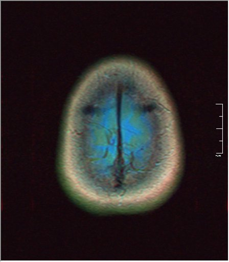
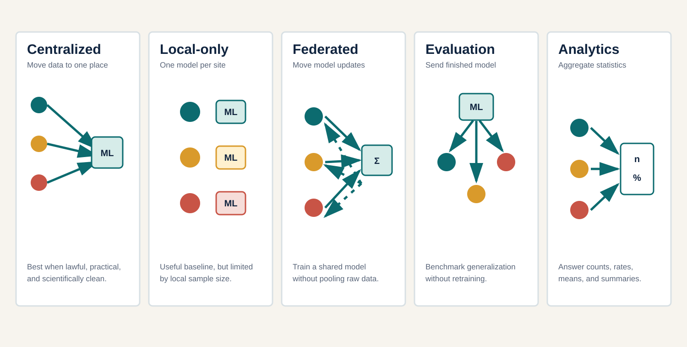
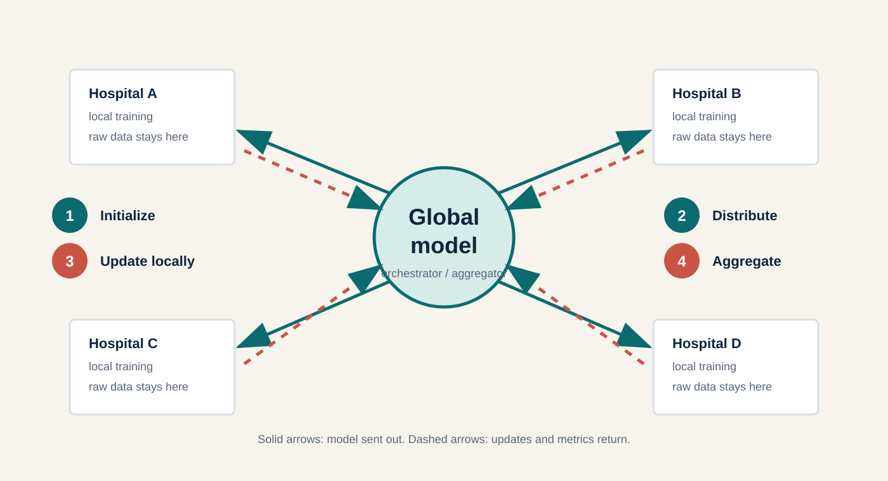

# Federated Learning in Medical AI: When Data Cannot Move {.title-slide .no-generated-title #title}

:::: {.title-grid}
::: {.title-copy}

  
  
  Cercare Medical

<h1>Federated Learning in Medical AI: When Data Cannot Move</h1>

How it works, when it helps, and what can still go wrong &mdash; and for 20 minutes, you are part of the federation

<strong>Geng Sun</strong> Industrial PhD &middot; Cercare Medical / Aarhus University 18 August 2026

Federation does not replace multicentre science. It is one way to make multicentre science possible when data cannot move.

:::

::: {.title-visual}

MRI: Nevit Dilmen, Wikimedia Commons. Full licence in image log.

:::
::::

::: {.notes}
Timing: 0:40. Target 0:40 &middot; skip-if-late: cut the presenter line, keep name/date only.

Thesis: The course is about medical collaboration under constraints, not about selling an algorithm.

Opening sentence: "Federated learning becomes interesting at exactly the point where the clinical question is multicentre but the data cannot become multicentre in the usual way. Today you will not just watch that story — for about twenty minutes in the middle of this lecture, you will be part of it."

Main evidence: The title and affiliations frame the applied research context; the public MRI is a visual anchor only.

Clinical translation: Tell the audience that every lesson can be borrowed even if they never run FL.

Transition: Move from the title to a concrete four-hospital dilemma.

Optional skip: Skip image attribution aloud unless asked; keep the limitation visible.

Interaction instructions: Ask for a show of hands: who has worked with data that could not leave its institution?

Exact citation reminders: Public MRI attribution is recorded in `assets/mri/README.md` and `research/image-licence-log.md`.
:::

# 1. Four Hospitals, One Question {#four-hospitals-one-question}

Cercare Medical

:::: {.clinical-network}
::: {.site-card}
<strong>Aarhus</strong>

rare outcome &middot; careful MRI protocol &middot; small cohort

:::
::: {.site-card}
<strong>Copenhagen</strong>

large cohort &middot; different scanner fleet &middot; different workflow

:::
::: {.network-question}
Shared clinical question
Which evidence can be learned together when data cannot simply be pooled?
:::
::: {.site-card}
<strong>Odense</strong>

good labels &middot; outcome definition changed mid-study

:::
::: {.site-card}
<strong>Aalborg</strong>

rural referral mix &middot; missing modalities &middot; strict governance

:::
::::

::: {.question-band}
We want one clinically useful AI system. Which part should move: patients, data, models, metrics, or only conclusions?
:::

::: {.notes}
Timing: 1:30. Target 1:30 &middot; skip-if-late: drop the raise-of-hands wait to 5 seconds.

Thesis: The hard part is choosing the collaboration design before choosing the algorithm.

Opening sentence: "Imagine four hospitals that agree on the clinical question but disagree, for legitimate reasons, on what can leave the building."

Main evidence: Use the fictional hospital constraints as a teaching case; do not imply these are real AU or Cercare projects.

Clinical translation: This mirrors grant planning, ethics applications, data-processing agreements, and cohort definitions.

Transition: "In about five minutes, you will each get one of these hospitals yourselves."

Optional skip: If short on time, read only the question band.

Interaction instructions: Ask for a show of hands: who has worked with data that could not leave its institution? Then ask the audience to silently pick the first design they would propose.

Exact citation reminders: No citation needed; this is an original fictional scenario.
:::

# 2. Why Not Simply Pool the Data? {.focus-workflows #why-not-simply-pool}

Cercare Medical

:::: {.compact-evidence}
::: {}
Centralized
Pool all patient data in one place. Strongest statistical control; highest legal and logistical movement burden.
:::
::: {}
Local-only
Each hospital trains and keeps its own model. Easiest governance; weakest generalization beyond one hospital.
:::
::: {}
Federated
Data stay local; a shared model is built by exchanging model updates instead of records.
:::
::::

::: {.center-statement .compact}
Federated learning is one collaboration design among several &mdash; not automatically the right one.
:::

::: {.notes}
Timing: 2:10. Target 2:10 &middot; skip-if-late: show only the three kickers, skip the center statement.

Thesis: FL is one design in a larger design space, chosen for a reason, not by default.

Opening sentence: "Before touching any algorithm, a study has to decide what actually moves: patients, data, models, or only conclusions."

Main evidence: Rieke et al. and Kairouz et al. provide broad FL framing; the fuller five-design taxonomy (including federated evaluation and federated analytics) is in the backup slide if the audience wants the complete map.

Clinical translation: A PhD protocol should justify why model updates need to move, not merely assert that raw data stay local.

Transition: "So what does federation actually look like as a mechanism? One round, start to finish."

Optional skip: Skip to the center statement only if very short on time.

Interaction instructions: Ask which of the three they would propose for their own project, and why.

Exact citation reminders: Rieke et al. 2020; Kairouz et al. 2021; Karargyris et al. 2023.
:::

## Backup: Five Collaboration Designs

:::: {.editorial-two-col .visual-led .workflow-focus}
::: {}
{.visual .tall fig-alt="Five collaboration designs: central data pooling, local-only modelling, federated learning, federated evaluation, and federated analytics."}
:::
::: {}

<strong>Pool data:</strong> strongest control, highest movement burden.

<strong>Stay local:</strong> easiest governance, weakest generalization.

<strong>Federate training:</strong> share updates, not raw records.

<strong>Federate evaluation:</strong> test where data live.

<strong>Federate analytics:</strong> estimate before modelling.

:::
::::

The full five-design vocabulary distinguishes federated *training* from federated *evaluation* (test a model where data live, without training) and federated *analytics* (estimate simple statistics before ever fitting a model). Use this slide if the audience asks "isn't there something short of full FL?"

# 3. One Federated-Learning Round {#one-federated-learning-round}

Cercare Medical

:::: {.lab-layout .round-lab}
::: {.round-panel}
{.visual fig-alt="A federated-learning round with local training, update transfer, aggregation, and return of the shared model."}

Raw patient data stay local. Information still moves.

:::
::: {}

1Global model exists at the server.

2Server broadcasts it to hospitals.

3Patient data never leave any hospital.

4Each hospital trains locally.

5Only model updates travel back.

6The server aggregates the updates.

7A new shared model is broadcast again.

:::
::::

::: {.notes}
Timing: 1:40. Target 1:40 &middot; skip-if-late: click through all 7 steps in silence, skip narration of steps 2-3.

Thesis: One round looks simple; the trouble is hidden inside the word "aggregate."

Opening sentence: "Train locally, send an update, aggregate, repeat. Watch step 6 closely — that is where today's activity lives."

Main evidence: FedAvg is the baseline aggregation idea, but site size, label quality, prevalence, and fairness goals can point in different directions. The mechanics here are covered by McMahan et al. 2017.

Clinical translation: If a small hospital serves the population you most care about, sample-size weighting can make it nearly silent — this is exactly what the live activity will let you see happen.

Transition: "So let's stop watching a diagram of a federation and become one. Everyone, phones out."

Optional skip: If short on time, narrate steps 1, 4, 5, 6, 7 only and skip 2-3.

Interaction instructions: Click through the fragments one at a time, pointing at the diagram for each step.

Exact citation reminders: McMahan et al. 2017; Kairouz et al. 2021.
:::

## Backup: FedAvg Formula

FedAvg updates a shared model by a weighted average of local model parameters or updates:

$$
w_{t+1} = \sum_{k=1}^{K} \frac{n_k}{\sum_j n_j} w_{t+1}^{(k)}
$$

Where \(n_k\) is the number of local training examples at site \(k\). The formula is easy to teach; the clinical policy embedded in the weights is not.

## Backup: Aggregation Sandbox (Non-Live Fallback)

Use only if the live federation activity cannot run at all (e.g. no devices in the room).

<iframe class="lab-frame" src="labs/aggregation/index.html?embed=1" title="Interactive aggregation sandbox" scrolling="no"></iframe>
<a class="lab-open" href="labs/aggregation/index.html" target="_blank" rel="noopener">Open full lab</a>

A pre-built four-hospital sandbox with sample-size, equal-site, and quality-aware weighting toggles. Kept working as a manual fallback and as post-lecture practice material.

# 4. You Are Now a Federated Client {#you-are-now-a-federated-client}

Cercare Medical

:::: {.lab-layout .round-lab}
::: {.round-panel}

Your hospital cannot send patient data to the central server.

For teaching, your phone represents a federated client. The local training outcome has been simulated so we can inspect a full federation in a few minutes &mdash; a real update has thousands to millions of numbers, not two.

<a class="live-cta" href="live/admin/index.html" target="_blank" rel="noopener">Open Federation Dashboard →</a>
<a class="live-cta secondary" href="live/index.html?demo=1" target="_blank" rel="noopener">Preview student view</a>

Dashboard shows the JOIN QR full-screen. No backend? Click "Populate 60 demo clients" instead.

:::
::: {}
<iframe class="lab-frame" src="live/admin/index.html?embed=1&demo=1" title="Federation dashboard preview" scrolling="no"></iframe>
:::
::::

::: {.notes}
Timing: 2:20. Target 2:20 &middot; skip-if-late: skip to ~60% joined instead of 70-80%.

Thesis: The class becomes the federation instead of watching a picture of one.

Opening sentence: "You are now a federated client. Scan the code on the main screen — no login, no name, about 30 seconds."

Main evidence: This is a precomputed, deterministic synthetic simulation, not real distributed training; say this explicitly so no one leaves believing 60 phones just trained a neural network.

Clinical translation: None yet — this slide is entirely mechanical (join + explain the caveat) so the pedagogy lands on the next two slides.

Transition: "While you're scanning, here is exactly what your phone is about to show you."

Optional skip: Do not wait for 60/60. Proceed once roughly 70-80% have joined, or after about 90 seconds, whichever comes first.

Interaction instructions: Switch the projector to the Federation Dashboard (or open it full-screen), click "Create / reset session," then "Show JOIN QR." If Wi-Fi is unreliable, click "Populate 60 demo clients" immediately and narrate as if the room just joined — the resulting federation is identical either way.

Exact citation reminders: No new citation; this slide is the activity's mechanical on-ramp.
:::

# 5. Meet Our Federation {#meet-our-federation}

Cercare Medical

:::: {.lab-layout .round-lab}
::: {.round-panel}

Would you trust all these hospitals equally?

Would you <em>weight</em> all these hospitals equally?

These are deliberately different questions.

<a class="live-cta" href="live/admin/index.html" target="_blank" rel="noopener">Open Federation Dashboard →</a>

:::
::: {}
<iframe class="lab-frame full" src="live/admin/index.html?embed=1&demo=1" title="Federation map preview" scrolling="no"></iframe>
:::
::::

::: {.notes}
Timing: 2:30. Target 2:30 &middot; skip-if-late: ask only the trust question, skip the weight question until Round 1.

Thesis: Trust and influence are different axes; the room usually conflates them.

Opening sentence: "Freeze enrollment. Look at the map — every dot is one of you, sized by how many patients your hospital has."

Main evidence: Node size encodes local sample size; shape/glyph encodes participation status and rare-population sites, never colour alone.

Clinical translation: A hospital being small does not make it untrustworthy; it changes how much statistical weight its evidence should carry, which is a different judgement.

Transition: "Let's answer the weighting question for real. Round 1."

Optional skip: Skip the archetype explanation; just point at the size variation.

Interaction instructions: On the dashboard, click "Freeze enrollment." Point at 2-3 clearly different node sizes on the projector. Ask the trust question, take one or two verbal answers, then ask the weight question and let it hang unanswered into Round 1.

Exact citation reminders: No new citation.
:::

# 6. Round 1: Federated Averaging {#round-1-federated-averaging}

Cercare Medical

:::: {.lab-layout .round-lab}
::: {.round-panel}

F(w) = &sum;k=1K pk Fk(w) &nbsp;&nbsp;with&nbsp;&nbsp; pk = nk / &sum;j nj

Fk(w): what hospital k wants the model to optimize locally. pk: how much influence that hospital receives. Aggregation is partly a statement about whose objective matters &mdash; and partly a statistical/optimization choice, not purely a fairness decision.

<a class="live-cta" href="live/admin/index.html" target="_blank" rel="noopener">Open Federation Dashboard →</a>

:::
::: {}
<iframe class="lab-frame full" src="live/admin/index.html?embed=1&demo=1" title="Aggregation weights and vectors preview" scrolling="no"></iframe>
:::
::::

::: {.notes}
Timing: 2:40. Target 2:40 &middot; skip-if-late: show the resultant arrow only, skip clicking through per-client weights.

Thesis: FedAvg makes every training example count equally — which means hospitals do not count equally.

Opening sentence: "Run FedAvg. Watch the arrows on the right: each one is somebody's simulated update. The white arrow is what the server actually keeps."

Main evidence: p_k = n_k / sum(n_j) is exactly the weight shown in the bar chart; the largest bar is the largest hospital in the room. Formula and picture must correspond exactly. McMahan et al. 2017 is the primary citation.

Clinical translation: A rare-population hospital's clinically important signal can visually shrink to a thin, low-opacity line the moment sample-size weighting is applied.

Transition: "Notice something — not everyone's arrow points the same way. Why not?"

Optional skip: Skip deriving the formula symbol-by-symbol; just point at the correspondence between a bar and an arrow's opacity.

Interaction instructions: On the dashboard, click "Start Round 1," confirm aggregation policy is "FedAvg," and narrate the weights panel: "largest client weight: X%." Point at one specific large node's bar and its thick, opaque arrow, then a small node's thin, faint arrow.

Exact citation reminders: McMahan et al. 2017; Kairouz et al. 2021.
:::

# 7. The Data Are Not IID {#the-data-are-not-iid}

Cercare Medical

:::: {.editorial-two-col}
::: {}
<figure class="iid-compare agree">

<figcaption>IID-ish: different data, similar learning direction.</figcaption>

</figure>

<strong>Feature shift</strong>
scanner &middot; protocol

<strong>Label shift</strong>
prevalence differs

<strong>Concept shift</strong>
outcome means differently

<strong>Workflow shift</strong>
referral &middot; annotation

:::
::: {}
<figure class="iid-compare">

<figcaption>Non-IID: local objectives disagree.</figcaption>

</figure>

Institution is a latent variable. Federation makes that fact harder to ignore.

:::
::::

::: {.notes}
Timing: 2:30. Target 2:30 &middot; skip-if-late: skip the four shift-type cards, keep only the two arrow figures and the center statement.

Thesis: Heterogeneity is not noise to average away; it is a clinical clue, and you already saw it in your own federation.

Opening sentence: "Go back to your own site card. Some of your arrows agreed with your neighbours'; some clearly did not. That disagreement has a name: non-IID."

Main evidence: Zech et al. showed site-level generalization failures in chest radiograph models; FedBN and related work target feature shift by keeping selected normalization local.

Clinical translation: The same habit applies to any multicentre study: stratify, visualize, and document why sites differ before blaming "noise."

Transition: "Now let's stress the federation on purpose and see what happens to these disagreements."

Optional skip: Skip method names (FedBN) if the audience is clinically mixed; keep only the four shift labels.

Interaction instructions: Ask 2-3 students with visibly different archetypes (read from their own phone) to shout out one line from their site card. Use one short element from the MRI domain-shift lab only if time allows — do not run the entire lab live.

Exact citation reminders: Zech et al. 2018; Li et al. 2021 FedBN.
:::

# 8. Round 2: Federation Under Stress {#round-2-federation-under-stress}

Cercare Medical

:::: {.lab-layout .round-lab}
::: {.round-panel}

Predict first: what will happen to the aggregate when one hospital looks very different?

<strong>B &middot; Rare hospital:</strong> a small, clinically distinctive site.

<strong>C &middot; Suspicious update:</strong> one extreme, unexplained update.

<a class="live-cta" href="live/admin/index.html" target="_blank" rel="noopener">Open Federation Dashboard →</a>

:::
::: {}
<iframe class="lab-frame full" src="live/admin/index.html?embed=1&demo=1" title="Teaching event and aggregation policy preview" scrolling="no"></iframe>
:::
::::

::: {.notes}
Timing: 2:50. Target 2:50 &middot; skip-if-late: run only ONE event (rare hospital), skip the strategy comparison.

Thesis: Robust aggregation bounds an outlier's influence; it cannot diagnose why the outlier happened.

Opening sentence: "Predict before I click: if I make one hospital's population rare and clinically important, what happens to its voice under FedAvg?"

Main evidence: Under FedAvg a small hospital's contribution shrinks toward its sample-size weight regardless of clinical importance; clipping and coordinate-median bound an extreme update's magnitude but do not explain it. Possible real-world causes of an unusual update — label error, preprocessing error, domain shift, corrupted training, a malicious client — are observationally similar from the server's side.

Clinical translation: "If this is the population we most care about, did federation solve our problem?" Robust statistics manage influence, not clinical meaning.

Transition: "So a global number just changed. Did it change for everyone the same way?"

Optional skip: Trigger only Event B (rare hospital) or only Event C (suspicious update) — not both. Skip the median/clipped comparison if late.

Interaction instructions: Ask the room to predict out loud, THEN click "B · Rare hospital" (or "C · Suspicious update") on the dashboard. Show FedAvg's result, then click one alternative aggregation policy (Clipped FedAvg or Coordinate median) to compare. Do not reveal which real-world cause the suspicious update represents — ask the room to list candidate explanations instead.

Exact citation reminders: Kairouz et al. 2021 (robust aggregation framing); no single paper is cited for the synthetic event itself.
:::

# 9. Did It Help Every Hospital? {#did-it-help-every-hospital}

Cercare Medical

:::: {.editorial-two-col}
::: {}
<figure class="mean-worst-compare">

↑ meanGlobal average performance

↓ worst siteRare / shifted hospital

</figure>

Numbers come from the live dashboard's synthetic evaluation panel &mdash; a coherent deterministic teaching simulation, not empirical research evidence.

:::
::: {}

The average model does not treat the average hospital.

"The average is not the deployment site."

:::
::::

::: {.notes}
Timing: 1:50. Target 1:50 &middot; skip-if-late: read the two boxed statements only, skip re-opening the dashboard.

Thesis: A clinically acceptable global average can still hide an unacceptable hospital.

Opening sentence: "Look back at the evaluation panel: the mean can go up while the rarest or most shifted hospital goes down at the same time."

Main evidence: This mirrors what FeTS reports in real distributed multi-site evaluation — average performance can hide institutional outlier weaknesses; the synthetic panel here is a teaching projection of that same finding, not a claim about a specific method.

Clinical translation: A study should predefine minimum acceptable performance at the site and subgroup level, not only global AUROC.

Transition: "So the model changed. What actually moved to make that happen — and what didn't?"

Optional skip: If very short, skip straight to the callout line and move on.

Interaction instructions: Point at the dashboard's evaluation panel (still visible from the previous slide) and read the mean and worst-site numbers aloud.

Exact citation reminders: Zenk et al. 2025 FeTS; Karargyris et al. 2023.
:::

# 10. Privacy: What Moves, What Stays {#privacy-what-moves-what-stays}

Cercare Medical

:::: {.lab-layout .privacy-lab}
::: {.privacy-map}

<strong>Stays local:</strong> raw records, direct identifiers, local preprocessing.

<strong>Still moves:</strong> model updates, metrics, counts, logs, released models.

Federated learning changes the privacy problem. It does not delete it.

:::
::: {}

The full interactive threat-surface explorer (gradient leakage, membership inference, poisoning, secure aggregation, differential privacy) is in the course resources.

<a class="live-cta secondary" href="labs/privacy-threat-model/index.html" target="_blank" rel="noopener">Open Privacy Threat-Surface Explorer →</a>
:::
::::

::: {.notes}
Timing: 1:40. Target 1:40 &middot; skip-if-late: read only the callout line and the two-column list.

Thesis: Privacy depends on flows, actors, logs, releases, and attack models, not only on where raw data sit.

Opening sentence: "Your phone never sent us a single patient record. It sent a two-number summary of an update — and in a real system, that update itself is an information channel."

Main evidence: Gradient leakage, membership inference, poisoning, secure aggregation, and differential privacy each address different parts of the threat surface; none of them is "solved" simply because raw data stayed put.

Clinical translation: Ask for a threat model in plain language: who can see what, what could they infer, and who responds if the assumption breaks.

Transition: "This is exactly the kind of problem real medical federations are already living with. Let's look at scale."

Optional skip: Skip the "open full explorer" pointer if time is tight; it is resource material, not live content.

Interaction instructions: Do not open the full lab live. State the caveat sentence exactly as written — it is the single most important sentence in this section.

Exact citation reminders: Shokri et al. 2017; Zhu et al. 2019; Bonawitz et al. 2017.
:::

# 11. Medical FL in the Real World {#medical-fl-in-the-real-world}

Cercare Medical

:::: {.compact-evidence}
::: {}
Scale
Pati et al.: 71 sites, six continents, 6,314 glioblastoma patients trained together.
:::
::: {}
Distributed evaluation
FeTS: 41 models evaluated across 32 institutions &mdash; average performance hid site-level failure, exactly like your dashboard just showed.
:::
::: {}
Evidence gap
612 healthcare-FL articles reviewed; only 32 (5.2%) were real-life clinical applications (Teo et al. 2024).
:::
::::

::: {.center-statement .compact}
Everything you just simulated becomes harder in real hospitals: more heterogeneity, more governance, less control.
:::

::: {.notes}
Timing: 1:50. Target 1:50 &middot; skip-if-late: keep only the scale and evidence-gap stats, drop FeTS detail.

Thesis: Medical FL has real scale and real evidence-of-failure-modes, but limited clinically mature evidence overall.

Opening sentence: "Everything you just did with 60 phones has a real analogue at 71 hospitals across six continents."

Main evidence: Pati et al. 2022 (scale); Zenk et al. 2025 FeTS (distributed evaluation, site-level failure); Teo et al. 2024 (612 articles, 32 real-life applications, 5.2%).

Clinical translation: A clinical PhD should separate technical feasibility, external validation, and routine clinical value when reading this literature.

Transition: "So what should actually stick with you from the last twenty minutes?"

Optional skip: Skip the Teo et al. evidence-gap statistic first if very short on time; keep scale and FeTS.

Interaction instructions: Ask the audience what kind of evidence would change their local practice. The full frontier map and real-world governance stack are in backup slides if there is time for questions.

Exact citation reminders: Pati et al. 2022; Karargyris et al. 2023; Zenk et al. 2025; Teo et al. 2024; Li et al. 2025; Bujotzek et al. 2025.
:::

## Backup: Achievement Versus Evidence Gap

:::: {.evidence-funnel}
::: {.funnel-step}
<strong>612</strong>
included healthcare FL articles
:::
::: {.funnel-arrow}
→
:::
::: {.funnel-step .accent}
<strong>32</strong>
real-life FL applications
:::
::: {.funnel-arrow}
→
:::
::: {.funnel-step .conclusion}
<strong>small</strong>
clinically mature evidence base
:::
::::

**Search and inclusion:** 24,060 individual records identified; 778 screened after title/abstract; 612 included in final analysis.

**Application maturity:** 65.0% technical FL framework with prototype; 17.0% framework without prototype; 5.2% real-life application.

**Data types:** 41.7% medical imaging; 23.7% clinical data or EHR; remainder spans IoT, histology, genomics, and combinations.

## Backup: Brain Cancer Case Detail

:::: {.brain-grid .visual-led}
::: {.mri-card}

Public teaching visual only; not Pati/FeTS data.

:::
::: {}

1<strong>Distributed training</strong> 71 sites &middot; six continents &middot; 6,314 glioblastoma patients

2<strong>Distributed benchmarking</strong> MedPerf evaluates models without moving test data

3<strong>Federated external evaluation</strong> FeTS: 41 models across 32 institutions

4<strong>Site-specific failures</strong> good average performance can hide weak sites

:::
::::

## Backup: The Real-World Federation Stack

::: {.layered-stack}

<strong>Visible top:</strong> model &middot; optimizer &middot; aggregation &middot; schedule

<strong>Clinical</strong>intended use &middot; population &middot; labels &middot; decision workflow

<strong>Data</strong>harmonization &middot; missingness &middot; provenance &middot; quality control

<strong>Infrastructure</strong>identity &middot; compute &middot; networking &middot; monitoring &middot; incident response

<strong>Governance</strong>ethics &middot; contracts &middot; roles &middot; authorship &middot; withdrawal &middot; maintenance

:::

A federation is a collaboration before it is an algorithm. Eden et al. 2025 map procedural, relational, and structural governance mechanisms; Li et al. 2025 and Bujotzek et al. 2025 emphasize real implementation barriers.

## Backup: Research Frontier Map, 2026

:::: {.frontier-grid}
::: {.frontier-card}
<strong>Personalized / target-aware</strong>
Whose hospital should the model serve? 
Maturing methods FedWeight.
:::
::: {.frontier-card}
<strong>Multimodal / missing-modality</strong>
What can be shared when rows differ? 
Emerging incongruent MMFL.
:::
::: {.frontier-card}
<strong>Foundation models / PEFT</strong>
Can sites adapt large models cheaply? 
Promising biomedical FL reviews.
:::
::: {.frontier-card}
<strong>Federated evaluation / analytics / causal</strong>
Do we need training, testing, or estimation? 
Practical MedPerf.
:::
::: {.frontier-card}
<strong>Uncertainty, fairness, robustness, drift</strong>
Who is failed by the average? 
Essential FeTS + UQ.
:::
::: {.frontier-card}
<strong>Infrastructure, governance, reproducibility</strong>
Who is responsible when it breaks? 
Deployment-critical Eden.
:::
::::

**More mature:** FedAvg, FedProx, FedBN, SCAFFOLD, FedOpt; secure aggregation, differential privacy, membership-inference vocabulary; medical FL reviews and case studies.

**Clinically urgent:** site-level external evaluation; calibration, subgroup performance, abstention; governance and accountability.

**Emerging:** multimodal missing-modality benchmarks; federated foundation models and PEFT; federated causal inference and analytics at scale.

**A note on algorithm taxonomy** &mdash; these are not interchangeable "aggregation options": FedAvg is the server-aggregation baseline; FedProx modifies the *local* optimization objective with a proximal term; FedBN keeps selected normalization parameters local for feature-shift settings; SCAFFOLD uses control variates to reduce client drift; FedOpt is a server-side optimization family. None of these is simply "another averaging formula."

# 12. What Should You Remember? {#what-should-you-remember}

Cercare Medical

:::: {.borrow-grid}
::: {.borrow-card}
1

<strong>Data stay local; information does not.</strong>
Updates, metrics, and released models are still a channel.

:::
::: {.borrow-card}
2

<strong>A federation optimizes across different local worlds.</strong>
Non-IID is not a bug in the room — it is the room.

:::
::: {.borrow-card}
3

<strong>Aggregation embeds assumptions about influence.</strong>
Sample-size weighting is a choice, not a neutral default.

:::
::: {.borrow-card}
4

<strong>Global performance can hide local failure.</strong>
The average is not the deployment site.

:::
::::

::: {.center-statement .compact}
For medical AI specifically: heterogeneity &middot; privacy &middot; evaluation &middot; governance.
:::

::: {.notes}
Timing: 1:50. Target 1:50 &middot; skip-if-late: read the four numbered cards only, skip the second-layer line.

Thesis: The most useful takeaway is a protocol habit, not a slogan.

Opening sentence: "Four things to keep. You have already seen every one of them happen on your own phone in the last twenty minutes."

Main evidence: The four points come directly from what the live federation demonstrated: data movement, non-IID disagreement, aggregation-as-assumption, and worst-site failure.

Clinical translation: These map directly onto grant writing, ethics review, data-processing agreements, analysis plans, and deployment discussions.

Transition: "One more thing before you go — how to keep exploring this after class."

Optional skip: If very short, read cards 3 and 4 only — they are the ones most often missed.

Interaction instructions: Ask the audience which of the four would change one of their current projects.

Exact citation reminders: TRIPOD+AI; DECIDE-AI; Eden et al. 2025.
:::

## Backup: Q&A Prompts

:::: {.qa-board}
::: {.qa-anchor}

Q&A

Bring one real clinical AI project.

Map the federation before the method.

:::
::: {.qa-prompt-grid}

<strong>Use FL at all?</strong>Training, evaluation, analytics, pooling, or local-only?

<strong>Who could fail?</strong>Hospital, subgroup, drift scenario, or missing modality.

<strong>What must be governed?</strong>Updates, metrics, logs, released models, and incident response.

<strong>What would you predefine?</strong>Worst-site threshold, calibration, abstention, and stop rule.

:::
::::

Use if discussion is slow after the final slide, within the operational buffer.

# 13. Course Resources {#course-resources}

Cercare Medical

:::: {.closing-grid}
::: {}

FL helps when the clinical question is shared, but patient-level data cannot or should not be pooled.

It fails when heterogeneity, privacy, evaluation, and governance are treated as afterthoughts.

The transferable habit is to make the collaboration visible.

:::
::: {.qr-panel}
Course Resources QR &mdash; not the federation join code
{fig-alt="QR code for the course website."}

<a href="resources.html">Slides, labs, reading path, and references</a>

Course site: https://son-kou.github.io/summer-course-FL-pre/

:::
::::

::: {.notes}
Timing: 1:00. Target 1:00 &middot; skip-if-late: show the QR and read only the first closing line.

Thesis: FL is useful when it makes the real collaboration legible and testable.

Opening sentence: "One thing to remember: federation does not remove the multicentre problem; it gives you a way to do it explicitly. This QR is different from the one you scanned earlier — it goes to the permanent course site, labs, and references."

Main evidence: Recap the four principles and the medical-AI layer from the previous slide.

Clinical translation: Direct the audience to the labs, reading path, and references rather than adding new content.

Transition: End and invite questions (use the Q&A backup prompts if discussion needs a seed).

Optional skip: Skip the second and third closing lines if already over time; keep the QR up regardless.

Interaction instructions: Leave this QR slide up for the whole Q&A period. Explicitly say "this is the resources QR, not the federation join code" once, since the room saw a different QR twenty minutes ago.

Exact citation reminders: No new citations; all reference links are on `references.html`.
:::
